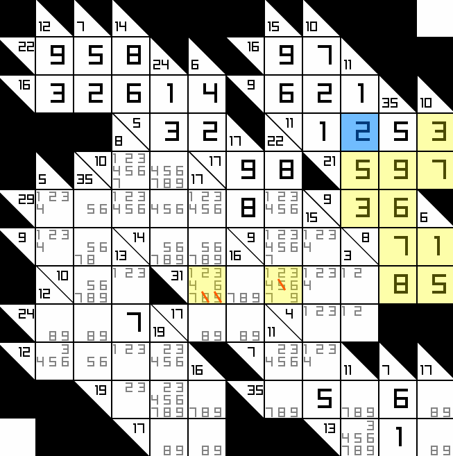

# zig-kakuro

  

A [Kakuro](https://en.wikipedia.org/wiki/Kakuro) solver written in Zig with a GUI for interactive solving.

The repo bundles 980 Kakuro puzzles from [Otto and Angela Janko's puzzle site](https://www.janko.at/Raetsel/Kakuro/), an excellent resource for logic puzzles of all kinds, and after some algorithm improvements zig-kakuro can now solve all 980 puzzles 😎

## Building

1. Download the Zig 0.13 for your platform [here](https://ziglang.org/download/) (but see [platform support](#platform-support) below).
1. Clone this repo to your local machine.
1. Run zig-kakuro in one of two ways:
  - Run `zig build gui` to run the GUI solver
  - Run `zig build solve` to run the solver on all the included Kakuros.

### Platform support

| OS / CPU arch. | Solver  | GUI |
|----------------|---------|-----|
| macOS x86      | ✅      | ✅  |
| macOS aarch64  | ✅      | ✅  |
| Windows 10 x86 | ✅      | ✅  |
| Linux          | ❓      | ❓  |

Legend:

✅ - Works without issues.
🐛 - Mostly works, but with some issues.
❌ - Does not work at all.
❓ - Untested.

If you run into any bugs or build issues, please [open an issue](https://github.com/schmee/zig-kakuro/issues/new).

## Acknowledgements

- https://www.janko.at/: for the puzzles bundled in `boards.txt`. An amazing website for logic puzzles of all kinds. The puzzles are licensed under Creative Commons 3.0, and are used for non-commercial purpose with attribution, see https://www.janko.at/Raetsel/Creative-Commons.htm for more information.
- [raylib](https://www.raylib.com/): used to build the GUI.
- [raylib-zig](https://github.com/Not-Nik/raylib-zig): Zig bindings for Raylib, makes it a breeze to get started with Zig + Raylib!

## License

zig-kakuro is licensed under the [MIT License](https://choosealicense.com/licenses/mit/).
